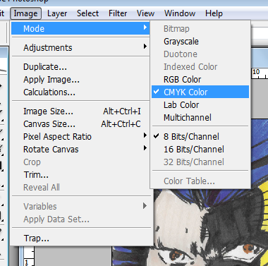
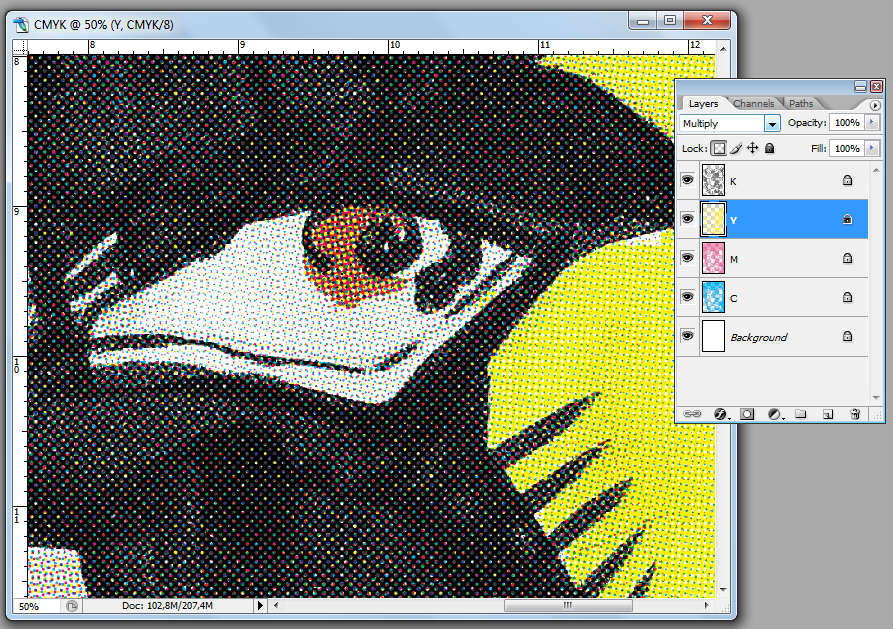

# 4-color process in Adobe Photoshop&ndash;creating the retro comic color halftones the easy and free way

## About the process

One of the iconic elements of mid-20th century comics was a terribly poor print on cheap paper and the four-color process. Tiny dots of color were printed one over the other to create a mixture that could produce any color. These dots were red, blue, and yellow with black on top.

*This panel from Detective Comics #31 clearly shows the famous dots. © DC Comics*

You may want to simulate this outdated process for nostalgic or artistic reasons. This tutorial can also be used as a starting process for screen printing or stamping.

## Instructions

> **NOTE**: the following description and pictures were done in **Adobe Photoshop CS2**. It should be clearly understandable also on newer version of the Photoshop interface.

The picture used to illustrate the process is my own recreation of a comic panel by Marc Silvestri, from the *Wolverine* solo series from 1990.

1. Load the image you want to process into Photoshop. Make sure the resolution is 300DPI. This is the industry standard for color printing, both offset and digital. If you aim at online publication and screen only you may use less resolution. This will produce larger halftones and you will need to adjust this value during step 4.

2. Change the color mode to CMYK. This is a printing standard.

3. Duplicate the file four times. Name the new files respectively C, M, Y, and K. These will be bases for separate color halftones, respectively cyan, magenta, yellow and black.

4. Enter the channels palette on file C, choose Cyan, and convert the channel into a bitmap (disregard other channels).

Choose the right resolution&ndash;300DPI is the default unless you decided to use different one in step 1. This affects halftone dots sizes in the resulting file.

Set the frequency to 60 lines. Choose the round shape. We will set with the angle next.

> The frequency affects the density and size of the dots. If you want them large and visible like Roy Liechtenstein’s, you have to play with this setting until you are satisfied with the results. 60 produces a nice, dense effect, perfect for printing on paper.

5. Repeat this process for every color file. Convert the proper channels and use respective angles for each color (see list below). This should produce four black-and-white files with halftones based on each basic CMYK color. You may want to keep the black converted to 50% threshold to make it opaque.

Setting the angles - this is very important! The values should be set as follows:

* cyan 15°
* black 45°
* magenta 75°
* yellow 0°

Such values make the three dark halftone dots form an equilateral triangle. This creates the effect of the circular distribution of the dots. The yellow creates a moire effect. As this color is light it does not affect the result adversely.

6. Convert all the files to grayscale with a 1:1 size ratio.

Select the color range&ndash;black with 200 fuzziness.

Now use **Ctrl/Cmd+J** to paste the selection as a layer and remove the background.

Do this for all four files. You now have four halftones with transparency.

7. Create a fresh CMYK file. Drag the 4 files you created in previous steps into the new file as separate layers. Name all the layers the same as the input files: C, M, Y, and K, to keep track of color halftones to fill in. Leave the background fully white. Keep blacks on top.

8. Block each of C, M and Y layer’s transparency. Fill the layer with proper color, e.i. fill the lowest one with cyan, then magenta, then yellow and the top one should be left black.

All the halftones are ready now.

9. Set layer modes to multiply for color layers, black can stay on normal.
 
> Note: by using black halftone instead of solid black and putting it on the bottom, you can achieve the poor old print effect.

10. You’re welcome.

